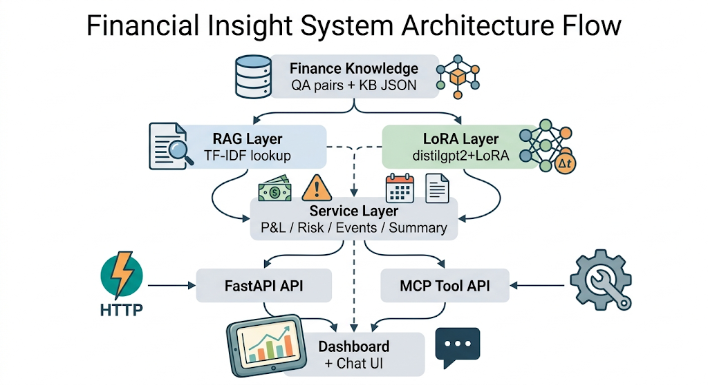
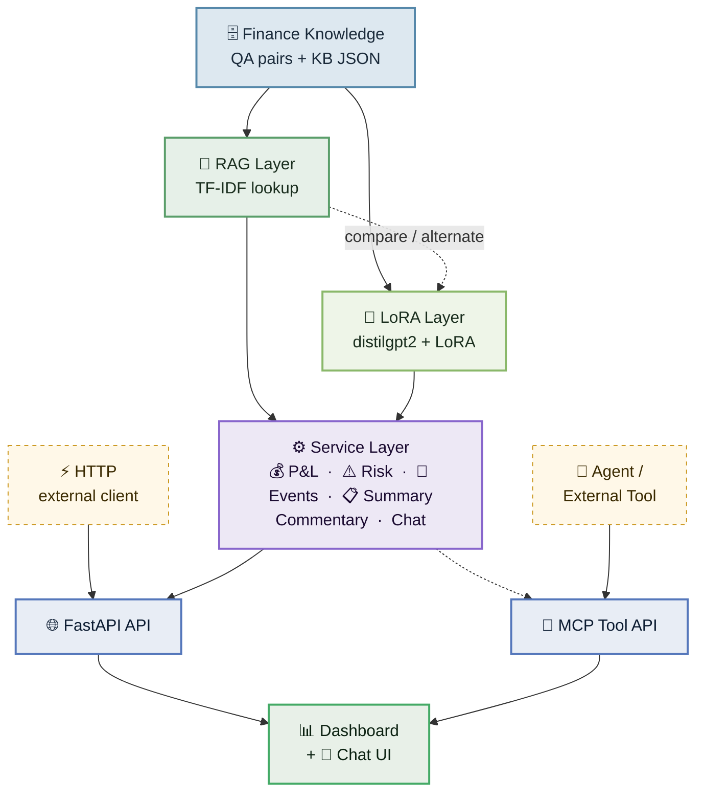

# Finance Analytics Platform

## Product Intent

This repository is a prototype finance analytics platform that combines:

- deterministic portfolio analytics
- grounded finance retrieval
- generative finance experimentation
- tool exposure through MCP
- a dashboard and chat interface

The product goal is simple:

`help a user understand portfolio P&L, risk, and stock-level context without letting an LLM invent the core numbers`

That principle drives the whole design:

- calculations remain deterministic
- retrieval provides grounded finance context
- generation is optional and sits on top of structured summaries
- the UI consumes stable APIs rather than calling models directly

---

## What Problem This Solves

A useful portfolio analysis workflow usually needs all of the following:

1. position and market state
2. P&L and exposure calculation
3. risk and stress analysis
4. event and news context
5. finance concept explanation
6. narrative interpretation

Most prototypes mix those responsibilities together. This repo deliberately separates them.

The intended product questions are:

- Why did my portfolio move?
- Where is my risk?
- What matters for this stock in my portfolio?
- What does this finance concept mean in the current context?

---

## System Overview

```text
Portfolio positions + market prices
        ->
P&L engine
        ->
Attribution / allocation / risk layer
        ->
Event and news retrieval
        ->
Summary builder
        ->
RAG grounding
        ->
Commentary / chat response
        ->
Dashboard / API / MCP tools
```

This flow is the core product architecture. It ensures the system does not ask a model to do the work of a pricing engine, risk engine, or portfolio accounting layer.

### Architecture Diagram



---

## Architecture Principles

### 1. Deterministic before generative

Portfolio values, P&L, risk, concentration, and stress losses should come from code, not from language models.

### 2. Retrieval is for grounding

RAG is used to explain finance concepts and bring back relevant contextual knowledge. It is not used to fabricate portfolio analysis from scratch.

### 3. Generation is a presentation layer

LoRA or any other LLM should summarize or narrate already-computed analytics, not replace them.

### 4. MCP is an interface layer

MCP is not a separate model. It is a tool exposure and orchestration layer that makes capabilities accessible to agents and UI actions.

### 5. The dashboard is a consumer, not the source of truth

The UI should render outputs from APIs and services, not contain core finance logic itself.

---

## High-Level Component Map



---

## Repository Structure

```text
finance_rag.py
finance_lora.py
finance_mcp_server.py
finance_compare.py
finance_config.py
finance_knowledge.py
finance_knowledge_base.json
test_finance_mcp.py

app/
  main.py
  api/
    chat.py
    commentary.py
    external_mcp.py        ← new
    mcp.py
    portfolio.py
    qa.py
    risk.py
    stocks.py
  models/
  services/
    external_mcp_client.py ← new
    chat_service.py
    commentary_service.py
    market_data_service.py
    mcp_service.py
    news_service.py
    pnl_service.py
    portfolio_service.py
    rag_service.py
    risk_service.py
    summary_service.py
  mcp/
    tools.py
  static/
    index.html
    styles.css
```

### Core scripts

- [`finance_rag.py`](/Users/dheerajkaranam/Projects/Finance_analyitcs/fianance_rag_lora_mcp/finance_rag.py)
  - local finance retriever
  - currently uses TF-IDF for stability
- [`finance_lora.py`](/Users/dheerajkaranam/Projects/Finance_analyitcs/fianance_rag_lora_mcp/finance_lora.py)
  - LoRA fine-tuning and generation path
- [`finance_mcp_server.py`](/Users/dheerajkaranam/Projects/Finance_analyitcs/fianance_rag_lora_mcp/finance_mcp_server.py)
  - MCP-style tool server for finance actions
- [`finance_compare.py`](/Users/dheerajkaranam/Projects/Finance_analyitcs/fianance_rag_lora_mcp/finance_compare.py)
  - comparison harness for RAG vs LoRA vs MCP
- [`finance_config.py`](/Users/dheerajkaranam/Projects/Finance_analyitcs/fianance_rag_lora_mcp/finance_config.py)
  - shared config constants
- [`finance_knowledge.py`](/Users/dheerajkaranam/Projects/Finance_analyitcs/fianance_rag_lora_mcp/finance_knowledge.py)
  - shared knowledge source for retrieval and training

### App package

- [`app/main.py`](/Users/dheerajkaranam/Projects/Finance_analyitcs/fianance_rag_lora_mcp/app/main.py)
  - FastAPI app entrypoint
- [`app/api/`](/Users/dheerajkaranam/Projects/Finance_analyitcs/fianance_rag_lora_mcp/app/api)
  - HTTP endpoints
- [`app/models/`](/Users/dheerajkaranam/Projects/Finance_analyitcs/fianance_rag_lora_mcp/app/models)
  - Pydantic data contracts
- [`app/services/`](/Users/dheerajkaranam/Projects/Finance_analyitcs/fianance_rag_lora_mcp/app/services)
  - portfolio, market, risk, summary, chat, and commentary services
- [`app/api/external_mcp.py`](/Users/dheerajkaranam/Projects/Finance_analyitcs/fianance_rag_lora_mcp/app/api/external_mcp.py)
  - FastAPI router for `/external-mcp/tools` and `/external-mcp/run`
  - bridges HTTP requests to the standalone `finance_mcp_server.py` process via `ExternalMCPClient`
- [`app/services/external_mcp_client.py`](/Users/dheerajkaranam/Projects/Finance_analyitcs/fianance_rag_lora_mcp/app/services/external_mcp_client.py)
  - JSON-RPC subprocess client for `finance_mcp_server.py`
  - spawns the server on first use, communicates over stdin/stdout, cleans up on exit
  - supports `initialize`, `tools/list`, and `tools/call` methods
- [`app/mcp/tools.py`](/Users/dheerajkaranam/Projects/Finance_analyitcs/fianance_rag_lora_mcp/app/mcp/tools.py)
  - MCP tool registry for the in-process app layer
- [`app/static/index.html`](/Users/dheerajkaranam/Projects/Finance_analyitcs/fianance_rag_lora_mcp/app/static/index.html)
  - dashboard frontend

---

## Backend Design

### Service Layer Responsibilities

The service layer is the backbone of the app.

#### Portfolio service
- position state
- cash
- portfolio snapshot
- sector allocation

#### Market data service
- current price
- overview metrics
- simple price history

#### P&L service
- market value
- unrealized P&L
- contribution %

#### Risk service
- largest position
- largest sector
- concentration
- stress scenarios

#### News service
- event feed by symbol

#### Summary service
- combines snapshot, P&L, risk, events, and finance context into one structured packet

#### RAG service
- explains finance concepts through retrieval

#### Commentary service
- converts structured summary into readable portfolio or stock narrative

#### Chat service
- answers contextual dashboard questions using portfolio state, events, and finance explanations

#### MCP service
- exposes selected in-process capabilities as callable tools via `/mcp`

#### External MCP client service
- spawns `finance_mcp_server.py` as a subprocess on first use
- communicates via stdin/stdout JSON-RPC (initialize → tools/list → tools/call)
- exposed through `/external-mcp` endpoints so the dashboard can call standalone MCP tools without browser-level subprocess access

---

## Frontend Design

The frontend is currently a lightweight HTML/CSS/JS interface served by FastAPI.

It demonstrates:

- dashboard cards for high-level stats
- positions and P&L tables
- risk summary
- allocation visual
- stock drilldown
- events
- commentary
- contextual chat
- external MCP tool actions (Stock Price, Investment Math, Finance Q&A) routed through `/external-mcp/run`

The MCP action card was updated to call the external MCP endpoint (`/external-mcp/run`) instead of the in-process MCP endpoint. Tool arguments are now context-aware: `get_stock_price` passes the currently selected symbol from the dashboard state.

The frontend should be thought of as a prototype consumer of the backend, not a finalized product UI.

---

## Dashboard Preview

If you save a dashboard screenshot to `docs/dashboard-preview.png`, this section will render it directly in GitHub:

```markdown

```

Current preview intent:

- headline portfolio summary
- daily P&L hero card
- top-level NAV, cash, return, and unrealized P&L stats
- positions table
- P&L attribution table
- additional lower sections for risk, allocation, drilldown, chat, and MCP actions

Recommended repository path for the screenshot:

```text
docs/dashboard-preview.png
```

---

## Main User Workflows

### Workflow 1: Why did my portfolio move?

```text
Positions + prices
-> P&L service
-> risk / concentration context
-> recent events
-> commentary/chat explanation
```

What the user gets:
- current P&L
- largest exposures
- relevant watch items
- narrative summary

### Workflow 2: Where is my risk?

```text
Portfolio positions
-> allocation and concentration
-> stress scenario outputs
-> explanatory finance context
-> dashboard and chat response
```

What the user gets:
- largest single-name exposure
- largest sector exposure
- stress loss examples
- explanation of why concentration matters

### Workflow 3: Analyze this stock

```text
Selected symbol
-> stock overview
-> price history
-> symbol events
-> portfolio position context
-> commentary
```

What the user gets:
- stock metrics
- event flow
- whether the name matters to the portfolio
- a short stock-specific narrative

### Workflow 4: Ask the assistant

```text
User question
-> chat endpoint
-> summary + risk + event context
-> optional concept grounding
-> grounded answer + citations
```

What the user gets:
- a contextual reply
- references to the underlying portfolio facts

---

## RAG, LoRA, and MCP: How They Differ

### RAG

Current implementation:
- TF-IDF retrieval over finance QA pairs

Role:
- explain finance concepts
- provide grounded context quickly

### LoRA

Current implementation:
- `distilgpt2` fine-tuned with LoRA over finance QA-style text

Role:
- narrative generation experiment
- candidate commentary layer

### MCP

Current implementation:
- tool exposure over JSON-RPC and HTTP wrapper

Role:
- tool interface
- orchestration surface
- future agent integration point

### Important comparison note

`RAG vs MCP vs LoRA` is not a pure apples-to-apples model benchmark.

What it really means:
- `RAG`: direct retrieval
- `MCP`: the same retrieval capability through a tool layer
- `LoRA`: a generative model path

So the comparison is useful for latency and response quality, but `MCP` is not a separate model.

---

## Quickstart

### 1. Clone and install

```bash
git clone https://github.com/Dheeraj31104/fianance_rag_lora_mcp.git
cd fianance_rag_lora_mcp
```

Recommended environment:

```bash
conda activate torch-env
```

Recommended packages:

```bash
pip install fastapi uvicorn pydantic transformers datasets peft torch faiss-cpu yfinance beautifulsoup4 requests scikit-learn pandas
```

### 2. Run the dashboard

```bash
python -m uvicorn app.main:app --host 127.0.0.1 --port 8000
```

Open:

```text
http://127.0.0.1:8000/
```

### 3. Run the scripts

RAG:

```bash
python finance_rag.py
```

LoRA:

```bash
python finance_lora.py
```

MCP:

```bash
python finance_mcp_server.py
```

Comparison:

```bash
python finance_compare.py
python finance_compare.py --questions "What is a stock?"
python finance_compare.py --json
```

---

## API Surface

### Portfolio
- `GET /portfolio/snapshot`
- `GET /portfolio/positions`
- `GET /portfolio/pnl`
- `GET /portfolio/allocation`

### Risk
- `GET /risk/report`
- `POST /risk/stress`

### Stocks
- `GET /stocks/{symbol}/overview`
- `GET /stocks/{symbol}/events`
- `GET /stocks/{symbol}/drilldown`

### Commentary and explanation
- `POST /commentary/portfolio`
- `POST /commentary/stock/{symbol}`
- `POST /qa/explain`
- `POST /chat`

### MCP
- `GET /mcp/tools`
- `POST /mcp/run`

### External MCP
- `GET /external-mcp/tools`
- `POST /external-mcp/run`

The external MCP endpoints start and talk to the standalone
[`finance_mcp_server.py`](/Users/dheerajkaranam/Projects/Finance_analyitcs/fianance_rag_lora_mcp/finance_mcp_server.py)
process through a subprocess JSON-RPC client. This gives the FastAPI app a way to call external tool capabilities without requiring the browser to interact with MCP directly.

---

## Verification

Syntax checks:

```bash
python -m py_compile finance_rag.py finance_lora.py finance_mcp_server.py finance_compare.py
python -m py_compile app/main.py app/api/*.py app/models/*.py app/services/*.py
```

If the FastAPI server is running:

```bash
curl -s http://127.0.0.1:8000/portfolio/snapshot
curl -s http://127.0.0.1:8000/risk/report
curl -s http://127.0.0.1:8000/portfolio/allocation
curl -s http://127.0.0.1:8000/stocks/AAPL/drilldown
curl -s http://127.0.0.1:8000/mcp/tools
curl -s http://127.0.0.1:8000/external-mcp/tools
curl -s http://127.0.0.1:8000/chat -X POST -H "Content-Type: application/json" -d '{"message":"Why is my portfolio moving today?","symbol":"AAPL"}'
```

---

## Current Status

### What works

- shared knowledge/config pipeline
- stable local RAG path
- MCP tool server
- comparison harness
- FastAPI app
- dashboard route
- contextual chat endpoint
- portfolio, risk, drilldown, commentary, and MCP HTTP APIs

### What is still prototype-grade

- portfolio data
- market data
- event feed
- attribution logic
- commentary sophistication
- dashboard usefulness

### Why RAG was changed

The original dense embedding retrieval path was replaced because the environment was unstable with `torch` / `sentence-transformers`.

The current retriever is intentionally simpler:
- local
- lightweight
- reproducible
- independent of the crashing embedding path

---

## Recommended Next Steps

### Engineering

1. Replace mock data services with real market and portfolio sources
2. Add real attribution logic
3. Expand risk to include factor and drawdown views
4. Add persistence for snapshots and events

### Product

1. Collapse the dashboard into three strong workflows:
   - why did it move?
   - where is the risk?
   - analyze this stock
2. Simplify the UI and remove low-signal debug surfaces
3. Make the chat use richer summary packets and better reasoning

### Model stack

1. Improve the narrative generation path
2. Reintroduce dense retrieval only after the runtime environment is stable
3. Keep deterministic analytics independent of any LLM path

---

## Bottom Line

This repo is best understood as:

- a finance analytics backend skeleton
- a retrieval/generation experimentation environment
- a dashboard prototype
- a stepping stone toward a more useful portfolio analysis product

Its strongest current quality is architectural separation.

Its weakest current quality is end-user usefulness of the dashboard.
